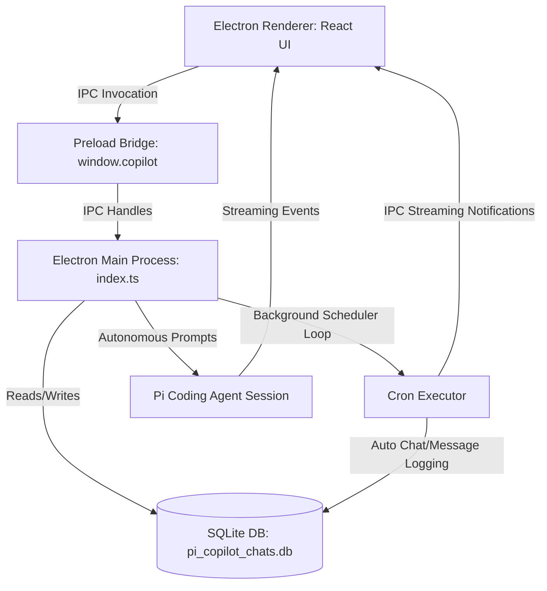

# Pi Desktop Copilot 🖤

An elegant, monochromatic, pure-black desktop client for the standard **Pi Coding Agent SDK**. Built with **Electron, React, and TypeScript**, it integrates a premium autonomous coding dashboard featuring persistent SQLite chat history, an automated background cron task scheduler, and secure on-the-fly configuration options.

---

## Key Features

- **⚡ Monochromatic Pitch-Black Aesthetic**: Sleek premium design with glassmorphic cards, custom code-block syntax highlighting with one-click copy buttons, silver metallic gradient badges, and a spotlit grid background.
- **💾 Persistent SQLite History**: Natively integrates Node 22's built-in `node:sqlite` module within the Electron main process, securely persisting chats, individual message transcripts, and scheduled crons to a local database (`pi_copilot_chats.db`) outside of the project workspace.
- **⏰ Background Cron Task Scheduler**:
  - Run autonomous agent prompts completely in the background on recurring cycles (_Every Minute_, _Every 5 Minutes_, _Every Hour_, _Every Day_, _Every Week_).
  - Automatically creates detailed cron history logs and handles full prompt-to-response generation natively.
  - Intercepts triggers in real-time to refresh the active workspace logs in the frontend.
- **⚙️ Sleek Settings Configuration Overlay**: Zero-setup onboarding experience. Launch directly to your project workspace. Open the settings gear overlay to securely set or update your OpenAI API Key, instantly re-initializing your active agent session on-the-fly.
- **🛠️ Custom Autonomous SDK Integration**:
  - **Web Search**: Integrates a custom high-performance DuckDuckGo scraper tool, allowing the agent to fetch up-to-date web answers.
  - **Skill Downloader**: Automatically clones custom Git skills on-the-fly into `.agents/skills/` and reloads the resource loader dynamically.
  - **Core SDK Suite**: Full native support for standard agent tools (`read`, `write`, `edit`, `bash`, `find`, `grep`, `ls`).

---

## Tech Stack

- **Frontend**: React, Lucide Icons, React Markdown (with `remark-gfm` and custom high-contrast code renderers).
- **Desktop App**: Electron, `electron-vite` (Fast builds & HMR).
- **Database**: Native Node 22 `node:sqlite` database.
- **Agent Engine**: `@earendil-works/pi-coding-agent`, `@earendil-works/pi-ai`, `@earendil-works/pi-agent-core`.
- **Styling**: Modern CSS utilizing customized spotlit grids and hardware-accelerated animations.

---

## System Architecture



---

## Getting Started

### Prerequisites

- **Node.js**: `v22.19.0` or higher (Required for built-in `node:sqlite` compatibility).
- **npm**: Version `v10` or higher.

### Installation

1. Clone the repository:

   ```bash
   git clone https://github.com/2Sunderam/pi-desktop-copilot.git
   cd pi-desktop-copilot
   ```

2. Install the standard dependencies:
   ```bash
   npm install
   ```

### Running Locally

To launch the hot-reloading development server:

```bash
npm run dev
```

### Static Quality Audits

- **Linter**: Run code style checks:
  ```bash
  npm run lint
  ```
- **TypeScript Compiler**: Run full type safety validation:
  ```bash
  npm run typecheck
  ```

### Packaging & Distribution

To bundle and package a standalone production release for your OS:

```bash
# For macOS
npm run build:mac

# For Windows
npm run build:win

# For Linux
npm run build:linux
```
